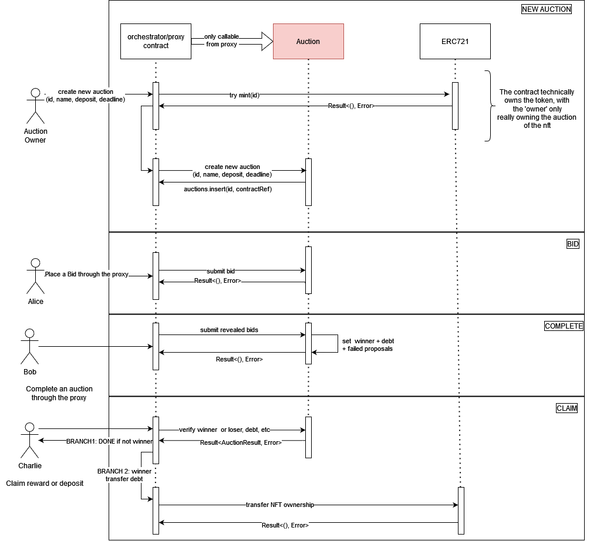

# Timelock Auction 

The **timelock auction contract** is a [Vickrey auction](https://en.wikipedia.org/wiki/Vickrey_auction), or `sealed-bid second-price auction` (**SBSPA**), enabled with timelock encryption via the ETF network. In a Vickrey auction, the highest bidder wins but the price paid is the second highest bid. Using timelock encryption enables a **non-interactive winner selection** for the auction, where all bids can be revealed with no interaction from the accounts that proposed them.

## How It Works

There are four phases to the auction. The idea is that an auction contains a deadline, a slot in the future. Bids are encrypted for the future slot offchain, using the etf.js SDK, and published in the contract along with a commitment to their bid (sha256 hash). Once the slot secret is revealed at the deadline, bidding closes and the auction can be completed. The ciphertexts must then be downloaded and decrypted offchain. Then, for each decrypted bid, the contracts calculates the hash and ensures it matches the hash provided by the bidder. Winner selection logic chooses the highest bidder as the winner.

### Setup

First, the auction owner specifies the auction item and deadline slot,  `((asset_id, amount), deadline, min_bid)` and deploys the auction. Then, the auction owner starts the auction by transferring ownership of the auction items to the contract.

### Bidding

The bidding phase starts as soon as the auction is deployed. Here, each participant 
- determines a bid, $b \geq bid_{min}$
- calculates a sha256 hash $ c = Sha256(b) $
- generates the ciphertext:
  
   $(ct, nonce, capsule) \leftarrow ETF.Enc(P, P_{pub}, b, deadline) $

- publish the ciphertext and hash: $((ct, nonce, capsule), hash)$ as a signed transaction to the smart contract

Notes:
- in the future, this can be modified to include a zk state proof that you've reserved the amount that was hashed to get $c$. This would be verified when selecting a winner.

### Non-Interactive Reveal and Winner Selection

As stated above, the main allure of this approach is to make the bid reveal and winner selection non-interactive, while retaining full decentralization. For now, this is not a zero-knowledge protocol, though through some tweaks it could be made into one.

The auction can be completed after the deadline passes. There are two parts to this phase, offchain decryption and onchain verification.

**OFFCHAIN**: download and decrypt all published ciphertext to recover the bids. Bids are recovered as follows:

- $sk \leftarrow ETF.Extract(slot) $ to retrieve the slot secret from the block in the given slot
- for each published $(who, (ct, nonce, capsule), hash)$, where $who$ is the account that published the data, decrypt the ciphertext $b' \leftarrow ETF.Dec(ct, nonce, capsule, sk)$
- complete the auction by publishing a map of account to decrypted bids, $(who_i, b'_i)$
- note: we must ensure ciphertext integrity when publishing it (i.e. a MAC)

**ONCHAIN**: the contract verifies each provided, revealed bid and then selects a winner.

- track the
- for each $who_i, b'_i$:
  - fetch the hash published by $who_i$, $c_i$
  - calculate $c'_i := Sha256(b'_i)$
  - check if $c'_i = c_i$. 
    - If not, then the revealed bid is invalid and the function returns an error.
    - If it is valid, store the bid and continue
- choose the winner as the first highest-bidder.

### Post-Auction

After the winner is selected, participants can call the auction contract to either:
- claim the prize if you are the winner
- reclaim your deposit if you are not the winner

Immediately post-auction, a countdown starts where the winner can claim the prize. The countdown can be configured when deploying the contract, and is a future slot number. When claiming the prize, the winner pays the second-highest bid. When the balance transfer is successful, the contract transfers ownership of the assets to the winner. If the winner doesn't claim the prize before the deadline, the next highest-bidder is selected as the new winner, and the countdown restarts. This can be done until the entire list of participants is exhausted if desired.

## Future Work
- currently, there is no relationship between the deposit, i.e.the collateral, which backs a bid. 
- there is no negative impact to participants who issue invalid bids. We intend to address this in the future, but that is out of scope for this doc.
