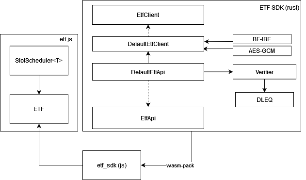
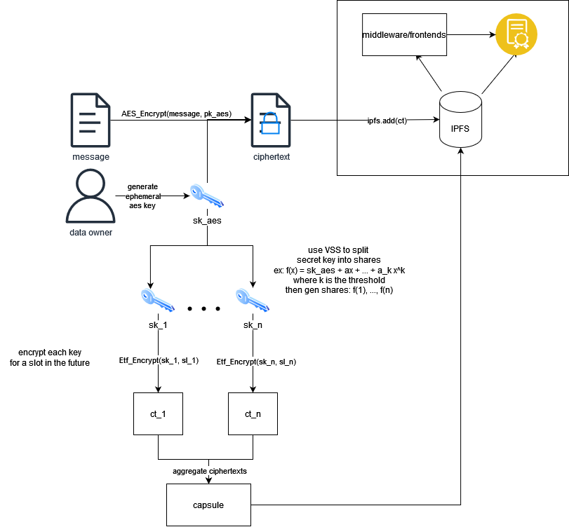

# ETF SDK

Timelock Encryption on the Ideal Network.

The ETF SDK is the core cryptographic module of our tech stack for building protocols and apps on top of the Ideal Network.



## Components

There are two main components that the SDK provides, the EtfClient and the EtfApi.

### EtfClient

The ETF Client is the core functionality of the SDK. The SDK implements functions to use the Ideal Network to encrypt and decrypt messages using **IBE** and **timelock encryption via AES/IBE**. The SDK is only one example of a capability which the Ideal Network enables (timelock encryption). The interface defines the method signatures required for our BF-IBE (which etf requires), however implementations have freedom to experiment. To implement it, implement the functions below:

```rust
    fn encrypt(
        ibe_pp: Vec<u8>,
        p_pub: Vec<u8>,
        message: &[u8],
        ids: Vec<Vec<u8>>,
        t: u8,
    ) -> Result<AesIbeCt, ClientError>;

    fn decrypt(
        ibe_pp: Vec<u8>,
        ciphertext: Vec<u8>,
        nonce: Vec<u8>,
        capsule: Vec<Vec<u8>>,
        secrets: Vec<Vec<u8>>,
    ) -> Result<Vec<u8>, ClientError>;
```

### EtfApi

The EtfApi pulls together the EtfClient and DLEQ proof verifier (and potentially other verifiers in the future). It is both std and no-std compatible, meaning it plays nicely both with rust (e.g. to build a CLI) and also as a wasm build. The EtfApi implementation can be compiled to wasm and used along with [etf.js](https://github.com/ideal-lab5/etf.js) to encrypt/decrypt messages.

We provide a default EtfApi implementation, which uses the DefaultEtfClient.

## Timelock Encryption (and Decryption)

**Encryption**

The ETF SDK includes an implementation of the EtfClient and EtfApi, found at [DefaultEtfClient](https://github.com/ideal-lab5/etf-sdk/blob/05f625f14cfd3c020e156e76beecb1a4e8a3f1ba/crypto/src/client/client.rs#L36) and [DefaultEtfApi](https://github.com/ideal-lab5/etf-sdk/blob/05f625f14cfd3c020e156e76beecb1a4e8a3f1ba/api/src/api.rs#L16). The client uses threshold secret sharing, AES-GCM ([AEADS](https://github.com/RustCrypto/AEADs/tree/master/aes-gcm)), and identity based encryption to generate aes secret keys and encrypt its shares to the future. In brief, it follows the diagram below. The output contains: `aes_out = (AES ciphertext, AES nonce, AES secret key), capsule = (encrypted key shares), slot_schedule`. The `capsule` contains the IBE encrypted key shares and the slot schedule are the slots for which they're encrypted. It assumes the two lists are the same size and follow the same order.



**Decryption**

Decryption works in reverse. When at least a threshold of slots in the slot schedule have had blocks produced within them, the aes secret key can be reconstructed by decrypting the partially decryptable capsule (e.g. can decrypt 2 of 3 shares) and using lagrange interpolation to recover the master secret, which is then used for decryption.
