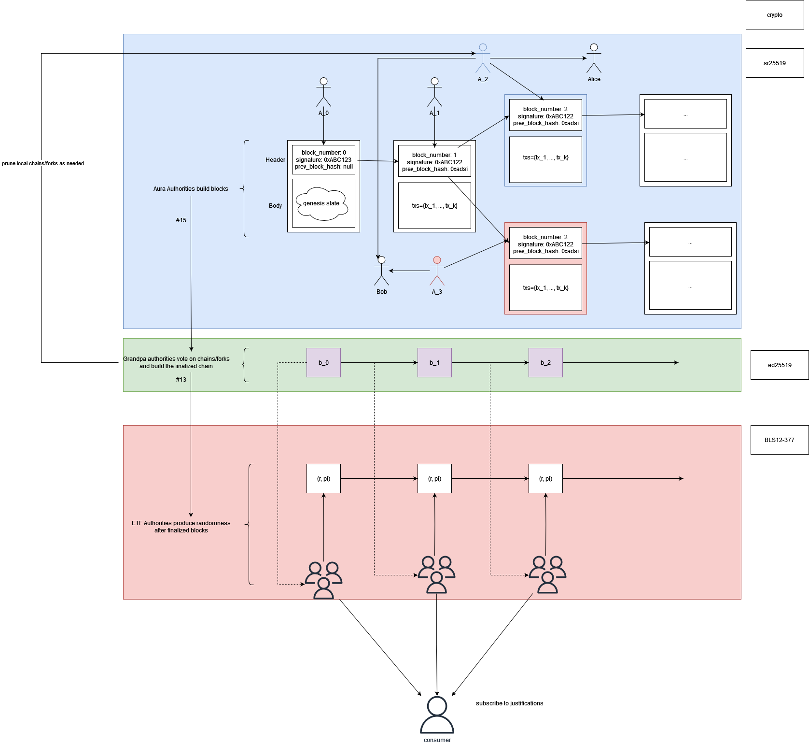

# ETF Post-Finality Gadget

This is an overview of the Ideal Network's post-finality gadget. We first describe the mechanism at a high level and then will dive into the architecture.

## Overview

The ETF-PFG functions similar to the [BEEFY](https://polkadotters.medium.com/from-kusama-to-polkadot-beefy-protocol-set-to-standardize-cross-chain-consensus-1e836bce774b) post-finality gadget (from which it is adapted). It leverages [efficient aggregatable BLS signatures](https://eprint.iacr.org/2022/1611). To begin, the network is seeded with a 'resharing' of a master secret, where we produce a single share per network authority. Each resharing is an output of our ACSS add link later (ACSS) protocol. On top of each finalized block, each authority uses the ACSS 'recovery' algorithm to extract their secret share from the publicly published 'resharing'. Using this, they produce a threshold BLS signature and DLEQ proof

For more details on the ACSS protocol and the rest of the underlying crypto, check out the [crypto] here.

### Seeding the Protocol

First, we produce master secret key offchain prior to genesis. In the future we will likely replace this with a fully-fledged distributed key generation mechanism. We also define an initial set of network authorities, for which we produce a sharing of the secret key. 

The encrypted shares are stored on-chain within the 'ETF' pallet (described below). 

### The ETF Worker

Each authority participating in the PFG does so by using an ETF worker. The ETF worker uses the local keystore to recover their secret shares from the encrypted shares added to runtime storage on genesis. Each worker uses the recovered share to produce a BLS signature, where they sign a commitment to the current last finalized block for which they haven't produced a signature. That is,  a commitment is essentially just a block number.

On top of this commitment, the threshold BLS signature if broadcast as a 'vote message', where we define a vote message as:

$M_v = (C, A_{id}^{etf}, A_{sig})$

Where $C$ is the commitment, $A_{id}^{etf}$ is a publcly known commitment to the expected resharing that this participant will recover, and $A_{sig}$ is the actual threshold BLS signature. 

Each worker constructs a vote message and gossips it to its peers. If the signature can be verified on the expected commitment, then we can produce a 'signed commitment', which is essentially just the commitment with a collection of each threshold BLS signature that was produced on top of it. 

Once a worker receives each vote message and verifies them, they each output the signed commitment as a 'justification', which we can read by subscribing to an RPC endpoint.

## Pallets

The network requires a pallet, the etf-pallet, to function. The etf-pallet stores public parameters that are required to enable identity based encryption. These values are calculated offchain and encoded in the genesis block.

### ETF Pallet

The ETF pallet stores public parameters needed for the IBE scheme. The values are set on genesis and only changeable by the root user (via the Sudo pallet) when they call the `update_ibe_params` extrinsic. The extrinsic uses Arkworks to decode the input to ensure that the provided data is a valid element of G2, and if so then it encodes it in storage. In the future, we intend to make this a more democratic process.

### Beefy-ETF Pallet

The Aura pallet included in the etf node is a modified version of the standard Aura pallet. Our version holds a new runtime storage map to hold slot secrets, which are added to storage in the `on_initialize` hook. 
