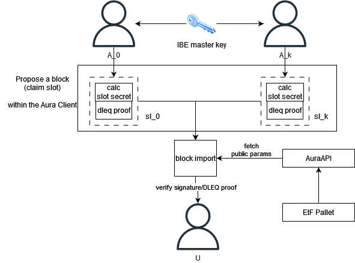

# EtF Network Architecture

ETF network is based on Aura consensus, a round-robin PoA (Proof of Authority) slot-based consensus mechanism. It utilizes DLEQ (Discrete Logarithm Equality) proofs to create BLS (Boneh-Lynn-Shacham) IBE (Identity-Based Encryption) block seals. Block importers verify the validity of the DLEQ proof when importing each block.

We also introduce the EtF pallet, which stores public parameters for the identity based encryption scheme. The pallet uses arkworks to ensure parameters stored in the runtime are decodable as valid group elements.

The AuraAPI has been enhanced to deliver IBE parameters and secret keys to both block proposers and block verifiers, facilitating a more efficient and secure block proposal and verification process.

## Pallets

## Encryption to the Future

Here we present a high-level overview of how EtF works. For a more in depth look, jump to the [math](./etf.md)

The initial version of the network uses a fork of Aura, a round-robin proof of authority consensus mechanism. Each authority knows the same secret, the IBE master secret which makes the identity based encryption scheme work (more on this [here]()). They are trusted to act as a secret key custodian (a requirement we will relax in the future).  When a slot author proposes a block, they first use the master secret to calculate a slot secret, which they add to the block header. This slot secret is intended to be **leaked** and made public. Next, in order to ensure the correctness of the secret to be leaked, block producers include a DLEQ proof that shows the slot secret was correctly calculated. Along with this, they also sign the block as usual. 

Block importers simply fetch the public IBE parameters from the EtF pallet and use it to verify the DLEQ proof. If the DLEQ proof is not valid, the block is rejected. 

